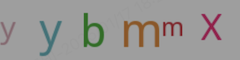
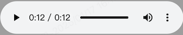

# Captcha  #

[](https://github.com/golang-module/base64Captcha/releases)
[](https://github.com/golang-module/base64Captcha/actions)
[](https://goreportcard.com/report/github.com/golang-module/base64Captcha)
[](https://pkg.go.dev/github.com/golang-module/base64Captcha)
[](https://github.com/golang-module/base64Captcha/blob/master/LICENSE)

#### 项目简介

一个轻量级、语义化、对开发者友好的 `golang` 验证码库，支持任何 Unicode 字符，可以轻松定制以支持语音、数学、中文、韩语、日语等

> Fork 于 [mojotv/base64Captcha](https://github.com/mojotv/base64Captcha)，由于原仓库不再更新和维护，所以拉取了一个分支，在此对原作者表示感谢。
#### 仓库地址

[github.com/golang-module/base64Captcha](https://github.com/golang-module/base64Captcha "github.com/golang-module/base64Captcha")

#### 安装使用

##### go version >= 1.16

```go
go get -u github.com/golang-module/base64Captcha
```

#### 用法示例

```go
import "github.com/golang-module/base64Captcha/store

// 使用内存存储(默认)
base64Store := store.DefaultMemoryStore

// 使用 sync map 存储
base64Store := store.DefaultSyncMapStore
```
#### 驱动配置
> 自定义配置时可以只定义需要修改的配置项，其他配置项将使用默认配置项

##### 1、配置纯数字验证码
```go
// 使用默认配置
base64Driver := driver.DefaultDriverDigit

// 使用自定义配置
base64Driver := driver.NewDriverDigit(driver.DriverDigit{
    Width:    240, // 宽度
    Height:   60,  // 高度
    Length:   6,   // 长度
    NoiseCount: 2, // 点数量
})
```

##### 2、配置纯字母验证码
```go
// 使用默认配置
base64Driver := driver.DefaultDriverLetter

// 使用自定义配置
base64Driver := driver.NewDriverLetter(driver.DriverLetter{
    Width:    240,  // 宽度
    Height:   60,   // 高度
    Length:   6,    // 长度
    NoiseCount: 2, // 点数量
    Source: "ABCDEFGHJKMNOQRSTUVXYZabcdefghjkmnoqrstuvxyz",
    Fonts:           []string{"wqy-microhei.ttc"},        // 显示字体
    BgColor: &color.RGBA{R: 0, G: 0, B: 0, A: 0}, // 背景颜色
})
```


##### 2、配置数学运算验证码
```go
// 使用默认配置
base64Driver := driver.DefaultDriverMath

// 使用自定义配置
base64Driver := driver.NewDriverMath(driver.DriverMath{
    Width:           240, // 宽度
    Height:          60,  // 高度
    NoiseCount:      2,   // 点数量
    ShowLineOptions: 0,   // 显示线条 
    Fonts:           []string{"wqy-microhei.ttc"},        // 显示字体
    BgColor:         &color.RGBA{R: 0, G: 0, B: 0, A: 0}, // 背景颜色
})
```

##### 3、配置字符串验证码(包含数字、大小写字母)
```go
// 使用默认配置
base64Driver := driver.DefaultDriverString

// 使用自定义配置
base64Driver := driver.NewDriverString(driver.DriverString{
    Width:           240, // 宽度
    Height:          60,  // 高度
    Length:          6,   // 长度
    NoiseCount:      2,   // 点数量
    ShowLineOptions: 0,   // 显示线条
    Source:          "ABCDEFGHJKMNOQRSTUVXYZabcdefghjkmnoqrstuvxyz", // 字符源
    Fonts:           []string{"wqy-microhei.ttc"},        // 显示字体
    BgColor:         &color.RGBA{R: 0, G: 0, B: 0, A: 0}, // 背景颜色
})
```

##### 4、配置汉字验证码
```go
// 使用默认配置
base64Driver := driver.DefaultDriverChinese

// 使用自定义配置
base64Driver := driver.NewDriverChinese(driver.DriverChinese{
    Width:           240, // 宽度
    Height:          60,  // 高度
    Length:          6,   // 长度
    NoiseCount:      2,   // 点数量
    ShowLineOptions: 0,   // 显示线条
    Source:          "设想,你在,处理,消费者,的音,频输,出音,频可,能无,论什,么都,没有,任何,输出,或者,它可,能是,单声道,立体声,或是,环绕立,体声的,,不想要,的值",  // 字符源
    Fonts:           []string{"wqy-microhei.ttc"},              // 显示字体
    BgColor:         &color.RGBA{R: 125, G: 125, B: 0, A: 118}, // 背景颜色
})
```


##### 5、配置语音验证码
```go
// 使用默认配置
base64Driver := driver.DefaultDriverAudio

// 使用自定义配置
base64Driver := driver.NewDriverAudio(driver.DriverAudio{
    Length:   6,    // 长度
    Language: "en", // 语言，目前支持：en、zh、ja、ru、de
})
```


##### 生成验证码
```go
captcha := base64Captcha.NewCaptcha(base64Driver, base64Store)

// 生成验证码
id, src, answer, err = captcha.Generate()

// 验证验证码
captcha.Verify(id, answer, true)
```
